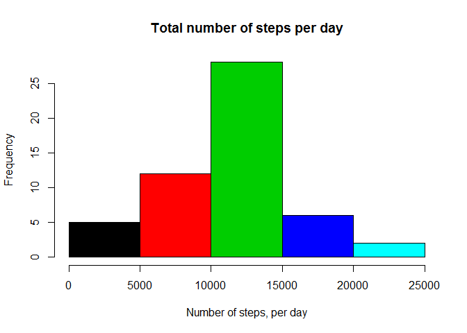

# Reproducible Research: Peer Assessment 1

## Loading and preprocessing the data
* load needed packages
* load the data file


```r
library(dplyr)
```

```
## Warning: package 'dplyr' was built under R version 3.2.3
```

```
## 
## Attaching package: 'dplyr'
```

```
## Следующие объекты скрыты от 'package:stats':
## 
##     filter, lag
```

```
## Следующие объекты скрыты от 'package:base':
## 
##     intersect, setdiff, setequal, union
```

```r
library(ggplot2)
```

```
## Warning: package 'ggplot2' was built under R version 3.2.3
```

```r
rs = read.csv("activity.csv")
```

## What is mean total number of steps taken per day?
* group the dataset by date
* summarise the grouped data by sum of steps
* create a histogram
* calculate the mean and the median of the total number of steps taken per day.


```r
rs.q.1 = rs %>% 
  group_by(date) %>% #group the data
    summarize(sum=sum(steps)) %>% #summarize it
      .[["sum"]] #get the sum column

#create a histogram
hist(rs.q.1, xlab="Number of steps, per day",col=1:5,main="Total number of steps per day")
```

\

```r
#calculate and print the mean and the median
mean.steps = mean(rs.q.1,na.rm=T)
median.steps = median(rs.q.1,na.rm=T)
print(mean.steps)
```

```
## [1] 10766.19
```

```r
print(median.steps)
```

```
## [1] 10765
```

## What is the average daily activity pattern?
* group the data by an interval
* summarise the grouped data by the mean of steps
* Make a time series plot (i.e. type = “l”) of the 5-minute interval (x-axis) and the average number of steps taken, averaged across all days (y-axis).


```r
rs.q.2 = rs %>% 
  group_by(interval) %>% #group the data
    summarize(mean.steps=mean(steps,na.rm=T)) #summarize it

#create the time-series plot
plot(rs.q.2$interval,rs.q.2$mean.steps, type="l",xlab="Interval", ylab="Average number of steps", main="Average number of steps averaged over all days")
```

\

```r
#search for the interval containing the maximum number of steps
max.steps.interval = rs.q.2[which.max(rs.q.2$mean.steps),]
print(max.steps.interval)
```

```
## Source: local data frame [1 x 2]
## 
##   interval mean.steps
##      (int)      (dbl)
## 1      835   206.1698
```

## Imputing missing values
* Calculate the total number of missing values in the dataset 
* Impute the missing values using the daily mean 
* Make a histogram of the total number of steps taken each day
* Calculate and report the mean and median total number of steps taken per day and compare it with the same values, calculated using the original dataset


```r
#calculate the total number of missing values
na.quantity = sum(!complete.cases(rs))
print(na.quantity)
```

```
## [1] 2304
```

```r
#copy the original dataset to the new one
rs.q.3 = rbind(data.frame(),rs)

#impute missing values using daily means
for(row in 1:nrow(rs)) {
  if(is.na(rs[row,"steps"])) {
    c.date = rs[row,"date"]
    rs.q.3[row,"steps"] = mean(rs["date"==c.date,"steps"],na.rm=T)
  }
}

rs.q.3 = rs.q.3 %>%
  group_by(date) %>% #group by date
  summarize(sum=sum(steps)) %>% #summarise it
  .[["sum"]] #get the sum column

#create a histogram
hist(rs.q.3, xlab="Number of steps, per day",col=1:5,main="Total number of steps per day")
```

\

```r
#calculate the mean and the median of the imputed dataset
mean.steps.imputed = mean(rs.q.3,na.rm=T)
median.steps.imputed = median(rs.q.3,na.rm=T)

answers = c(mean.steps,mean.steps.imputed,median.steps,median.steps.imputed)
names(answers) = c("mean of the original","mean of the imputed","median of the original","median of the imputed")
print(answers)
```

```
##   mean of the original    mean of the imputed median of the original 
##               10766.19               10766.19               10765.00 
##  median of the imputed 
##               10765.00
```

## Are there differences in activity patterns between weekdays and weekends?
* Create a new factor variable in the dataset with two levels – “weekday” and “weekend” indicating whether a given date is a weekday or weekend day.
* Make a panel plot containing a time series plot of the 5-minute interval (x-axis) and the average number of steps taken, averaged across all weekday days or weekend days (y-axis)


```r
#use the function for separating weekdays from weekands
weekends.or.weekdays = function(x){
  w = as.POSIXlt(as.Date(x, "%Y-%m-%d"))$wday
  if (w == 0 | w == 6) {
    "weekend"
  } else "weekday"
}
#create the new factor variable "day"
rs$day = vapply(rs$date,weekends.or.weekdays,character(1))
rs$day = as.factor(rs$day)

rs.q.4 = rs %>%
  group_by(interval,day) %>% #group by an interval and a day
    summarize(mean.steps=mean(steps,na.rm=T)) #summarize it, using mean function

#create a plot
p = qplot(interval, mean.steps, data=rs.q.4, geom=c("line"), xlab="Interval",ylab="Number of steps",facets=.~day)
print(p)
```

\
